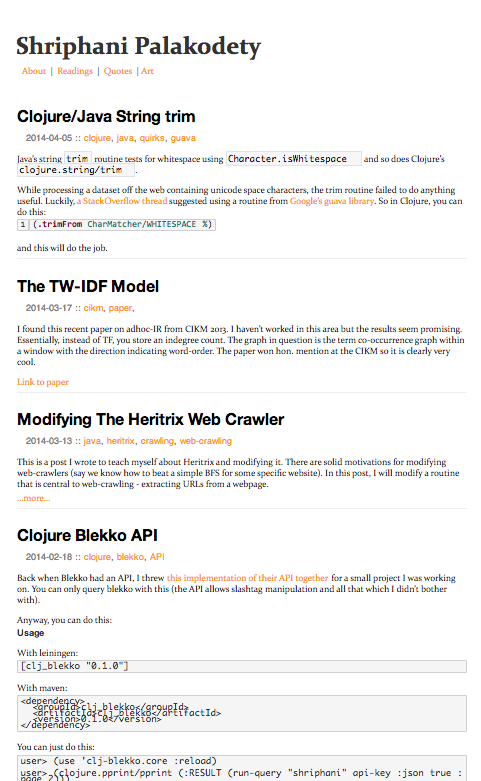

# subotai

<br />

Subotai contains a swiss-army-knife of data-mining tools on HTML
documents. It contains routines for:

1. Comparing the similarity (in structure) of HTML documents.
2. Extracting sets of records from these HTML documents.

## Literature

A list of the algorithms implemented:

* Structural similarity using tree-edit-distance from [Reis,
  Davi de Castro, et al](doc/rtdm.pdf).
* Near-Duplicate Detection (a naive algorithm from the IRBook by
  Manning et al and a scaleable version from [Manku et al](doc/ndd.pdf)).
* Extract records from a web-page - from
[Xinying Song, Jing Liu, Yunbo Cao, Chin-Yew Lin, Hsiao-Wuen Hon](doc/extraction.pdf).


## Usage

### Structural Similarity

Structural similarity routines are available in the
<code>subotai.structural-similarity</code> namespace.

To check if two documents have the same underlying structure (for
example, different pages of the same blog):

```clojure
user=> (use 'clj-http.client)
user=> (use 'subotai.structural-similarity.core :reload)
user=> (def bod1 (:body (get "http://blog.shriphani.com/"))) ; this is page 1
#'user/bod1
user=> (def bod2 (:body (get "http://blog.shriphani.com/index-2.html"))) ; this is page 2
#'user/bod2
user=> (similar? bod1 bod2)
true ; both pages have the same structure
user=>
```

The two pages in the above example look like:
<table>
    <tr>
    	<td></td>
	    <td></td>
	</tr>
</table>

### Near Duplicate Detection

Near Duplicate Detection routines are available in the
<code>subotai.near-duplicate</code> namespace. The simplest algorithm
implemented is the shingles algorithm (build a list of 4-grams,
compute the jaccard similarity, and perform a threshold test). I also
have a more scaleable algorithm from Manku et al (from WWW '07). To
compare two HTML documents (we default to the scaleable version but
you can specify a different algorithm in the function call):

```clojure

```


## License

Copyright © 2014 Shriphani Palakodety

Distributed under the Eclipse Public License either version 1.0 or (at
your option) any later version.
